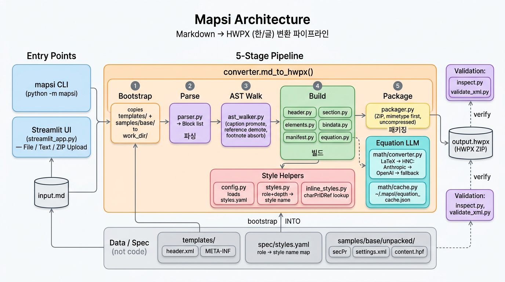
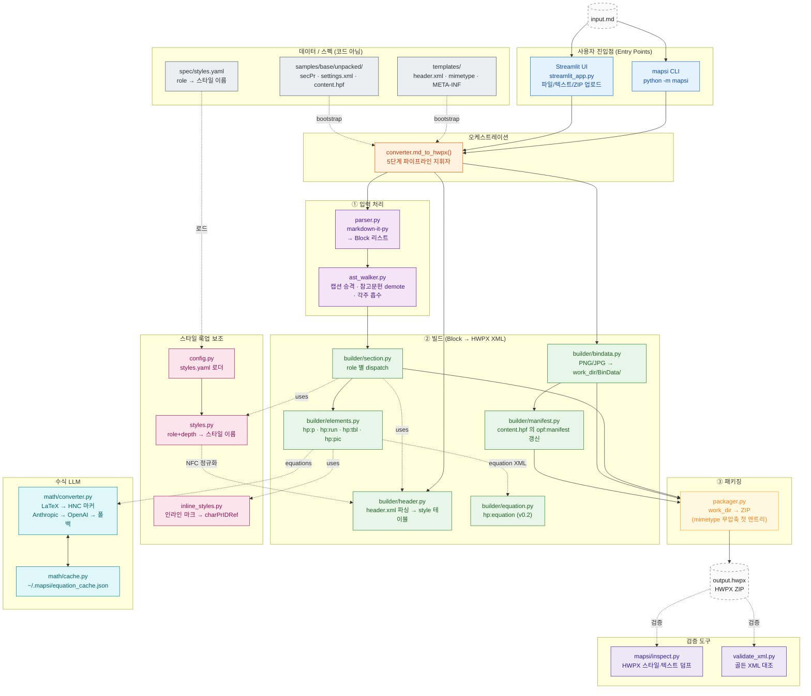
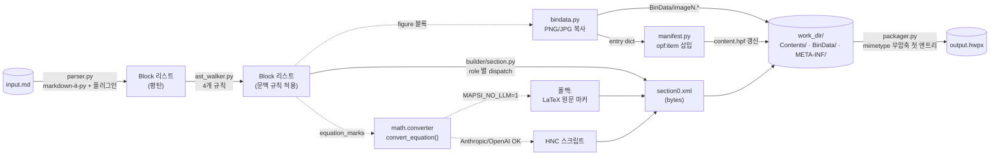
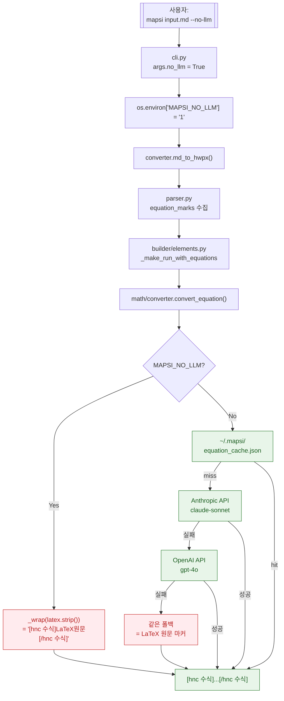
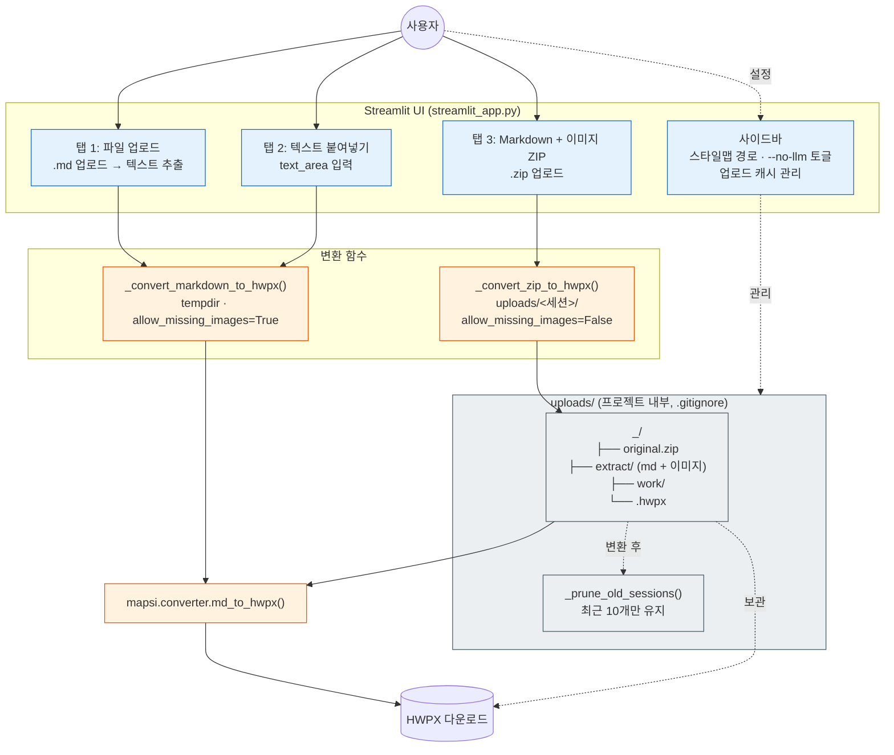
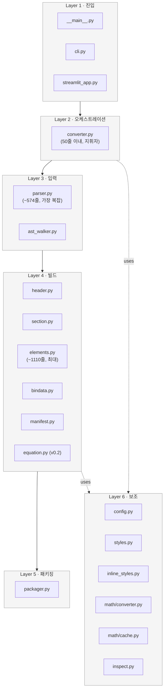

# Mapsi 아키텍처 다이어그램

> Mapsi 전체 시스템을 한눈에 파악하기 위한 Mermaid 다이어그램 모음.
> Figma / FigJam 에 바로 붙여넣기 가능하며, GitHub / Notion / VS Code 프리뷰에서도 그대로 렌더링된다.

## 0. 한 장으로 보는 개요

> Figma 에서는 `architecture.png` 를 드래그 앤 드롭하거나, 아래 Mermaid 코드 블록을
> *Mermaid Chart* 플러그인에 붙여 넣어 벡터 형태로 재생성할 수 있다.

---

## 1. 전체 아키텍처 (High-level)

---

## 2. 데이터 흐름 (Block → HWPX)

---

## 3. `--no-llm` 폴백 경로

---

## 4. Streamlit UI 3-탭 플로우

---

## 5. 모듈 레이어 요약 (Cheat Sheet)

---

## Figma / FigJam 사용 팁

- **FigJam** 은 `File → Import → Mermaid` 가 있으며 위 코드 블록을 그대로 붙여넣으면 자동 변환.
- **Figma (디자인 파일)** 에서는 `Mermaid` 플러그인 (ex. *Mermaid Chart*) 설치 후 이 코드 블록을 붙여넣으면 된다.
- 같은 디렉터리의 `architecture.png` 는 렌더된 정적 이미지라 어디든 드래그해 붙이기 가능.
