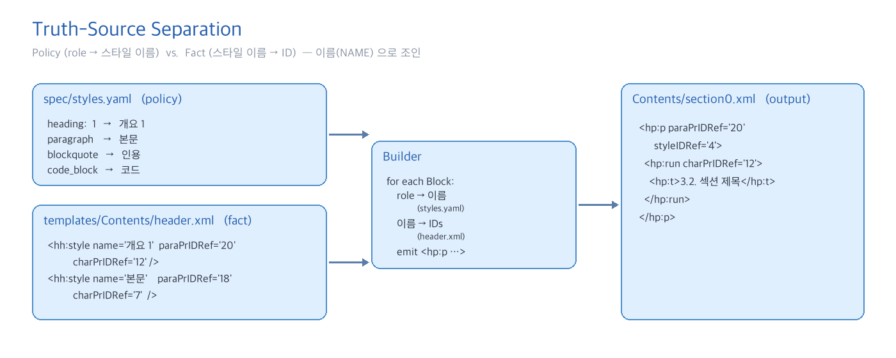
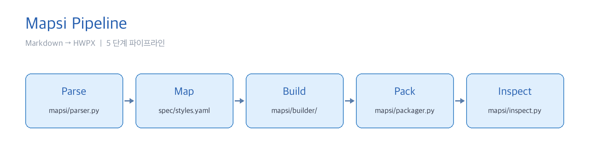
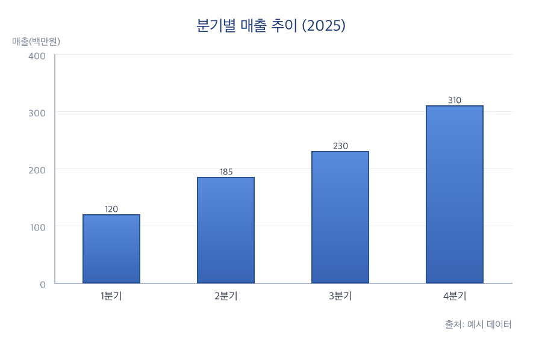

# Mapsi — 마크다운을 한/글로, 스타일까지

*이 문서 자체가 Mapsi 로 변환된 결과입니다.*

## 1. 소개

**Mapsi** (맵시) 는 마크다운 문서를 한/글 (`.hwpx`) 로 변환하면서 각 단락에
**적절한 스타일을 자동으로 부여**하는 변환기입니다. ~~본문만 복사하던~~
기존 변환기와 달리, 마크다운의 *구조적 역할* 을 한/글의 *스타일 이름* 에
이름 기반으로 매핑합니다.

소스코드는 [GitHub 저장소](https://github.com/duundichjames/Mapsi) 에서
확인할 수 있습니다. 문서 안의 베어 URL 도 자동 링크로 변환됩니다 —
예를 들어 https://spec.commonmark.org/ 같은 주소나 contact@mapsi.dev
같은 이메일은 Mapsi 가 알아서 `HYPERLINK` 필드로 감쌉니다.

## 2. 핵심 아이디어

Mapsi 는 **두 가지 진실원** 을 이름으로 조인합니다. `styles.yaml` 은
"무엇을 해야 하는가" 를 말하고, `header.xml` 은 "한/글이 그것을 어떻게
부르는가" 를 말합니다.



그림 1. 두 진실원의 분리 — 정책과 사실을 이름으로 조인

이 분리 덕분에, 한/글이 발급한 스타일 ID 가 달라져도 Mapsi 코드는 변경
없이 그대로 동작합니다.

### 2.1. 5 단계 파이프라인

변환은 다음 다섯 단계를 거칩니다.



그림 2. Mapsi 의 5 단계 파이프라인 — Parse · Map · Build · Pack · Inspect

각 단계의 역할은 다음과 같습니다.

1. **Parse** — `markdown-it-py` 로 토큰화해 `Block` 객체 시퀀스 생성
2. **Map** — 역할을 한/글 스타일 이름에 매핑 (`spec/styles.yaml`)
3. **Build** — `header.xml` 룩업으로 `paraPrIDRef` / `charPrIDRef` 확정
4. **Pack** — OPF 매니페스트와 함께 ZIP 으로 압축해 `.hwpx` 생성
5. **Inspect** — 한/글 없이 셸에서 구조적 정확성 검증

## 3. 지원하는 요소

표 1. Mapsi 가 처리하는 마크다운 요소와 한/글 매핑 결과

| 요소          | 마크다운 문법               | 한/글 스타일          | 비고                  |
| ------------- | --------------------------- | --------------------- | --------------------- |
| 제목 1~6      | `#` ~ `######`              | 개요 1~6              | 6 레벨 모두 지원      |
| 본문          | 일반 문단                   | 본문                  | 기본 스타일           |
| 순서 없는 목록| `- item`                    | 네모 / 동그라미 / 줄  | 3 단계 깊이           |
| 순서 있는 목록| `1. item`                   | 번호1 / 2 / 3         | 원문 번호 보존        |
| 인용문        | `> quote`                   | 인용                  | 인라인 마크 보존      |
| 코드 블록     | 삼중 백틱                   | 코드                  | 고정폭 글꼴           |
| 표            | 파이프 표                   | 표내용 + 표캡션       | 캡션 자동 승격        |
| 그림          | ``              | 그림 + 그림캡션       | 누락 시 placeholder   |
| 각주          | `[^1]` / `[^1]: 내용`       | 각주                  | 번호 자동 관리        |
| 수식          | `$ ... $` / `$$ ... $$`     | 평문 마커             | HNC 또는 LaTeX 원문   |
| 인라인 서식   | bold, italic, strike, code  | charPr 25 ~ 29        | Degradation 정책      |
| 하이퍼링크    | `[text](url)`, 베어 URL     | HYPERLINK 필드        | 실제 클릭 동작        |

표 2. 현재 프로젝트 규모

| 지표              | 값         |
| ----------------- | ---------- |
| 지원 마크다운 요소| 13 종      |
| 아키텍처 결정 (ADR)| 5 개       |
| 골든 회귀 픽스처  | 11 개      |
| 단위·통합 테스트  | 362 개     |
| 파이프라인 단계   | 5 단계     |

## 4. 리스트 레벨 시연

순서 없는 목록은 들여쓰기 깊이에 따라 **서로 다른 스타일** 을 받습니다.

- 최상위 항목 (네모)
- 최상위 항목에 *이탤릭* 이나 **굵은 글씨** 를 섞어도 잘 살아남습니다
  - 두 번째 깊이 (동그라미)
  - 같은 깊이의 다음 항목
    - 세 번째 깊이 (줄)
    - 더 깊은 레벨
- 다시 최상위로 복귀

순서 있는 목록은 원문 번호를 그대로 보존합니다.

1. 첫 번째 항목
2. 두 번째 항목에서 하위로 내려가면
   1. 2-1 하위 번호
   2. 2-2 하위 번호에 [링크](https://example.com) 포함
3. 세 번째 항목

## 5. 인용과 코드

> **단순함은 복잡함을 이긴다.** 진실은 단순함의 옷을 입고 나타난다.
> 이 인용문은 *이탤릭* 과 `inline code` 마저 보존합니다.
> — 익명

코드 블록은 들여쓰기와 줄바꿈을 그대로 유지합니다.

```python
from pathlib import Path
from mapsi.converter import md_to_hwpx
from mapsi.config import load_style_map

def convert(input_md: Path, output_hwpx: Path) -> None:
    """Markdown 파일을 한/글 HWPX 로 변환한다."""
    style_map = load_style_map(Path("spec/styles.yaml"))
    md_to_hwpx(
        md_path=input_md,
        output_path=output_hwpx,
        style_map=style_map,
    )

if __name__ == "__main__":
    convert(Path("demo.md"), Path("demo.hwpx"))
```

## 6. 수식

인라인 수식은 문단 속에 자연스럽게 흐릅니다. 예를 들어 아인슈타인의
$E = mc^2$ 이나, 등차수열의 합 공식 $\sum_{i=1}^{n} i = \frac{n(n+1)}{2}$
처럼 섞어 쓸 수 있습니다.

블록 수식은 별도 줄에 둡니다.

$$
\int_{-\infty}^{\infty} e^{-x^2} \, dx = \sqrt{\pi}
$$

정규분포의 분산은 다음과 같이 유도됩니다.

$$
\sigma^2 = \frac{1}{N} \sum_{i=1}^{N} (x_i - \mu)^2
$$

## 7. 각주 시연

Mapsi 는 마크다운 각주[^1] 를 한/글의 정식 각주 요소로 변환합니다.

내부적으로는 `hp:footNote` XML 요소로 감싸져 문서 말미가 아닌 페이지
하단 영역에 표시됩니다.

각주 번호는 본문 순서대로 자동 재할당되며[^2], 여러 개가 섞여 있어도
원문 매핑이 깨지지 않습니다.


## 8. 제목 깊이 시연

### 8.1. 제목 레벨 3

마크다운의 `###` 는 한/글의 **개요 3** 에 매핑됩니다.

#### 8.1.1. 제목 레벨 4

`####` 는 **개요 4** 입니다.

##### 8.1.1.1. 제목 레벨 5

`#####` 는 **개요 5** 로, 보통 세부 항목 구분에 쓰입니다.

###### 8.1.1.1.1. 제목 레벨 6

`######` 는 가장 깊은 **개요 6** 입니다. 여기까지 내려가는 일은 드물지만
Mapsi 는 6 레벨 모두 지원합니다.

## 9. 마치며

Mapsi 는 **구조** 와 **시각** 을 분리하는 설계로, 변환 이후 한/글 스타일
편집기에서 **한 번의 편집** 으로 문서 전체의 시각 일관성을 조정할 수
있습니다. 문의는 [이슈 트래커](https://github.com/duundichjames/Mapsi/issues)
또는 support@mapsi.dev 로 보내주세요.


## 10. ppt용 테스트
이것은 **중요한** 문장입니다.




그림 1. 분기별 매출 추이

## 참고문헌

1. CommonMark. *CommonMark Spec* (version 0.30). 2024.
   https://spec.commonmark.org/
2. 한글과컴퓨터. *HWPX 공개 스펙*. 2023.
3. Park, Jaesung. *python-hwpx: HWPX 파서/라이터 라이브러리*. GitHub. 2025.
4. Mapsi 팀. *Mapsi — Markdown Adapter for Paragraph-Style Injection*.
   2026. https://github.com/duundichjames/Mapsi

[^1]: CommonMark 확장 문법. `[^1]` 로 참조하고 `[^1]: 내용` 으로 정의합니다.
[^2]: Mapsi 는 각주를 원문 등장 순서대로 1 부터 재할당합니다.