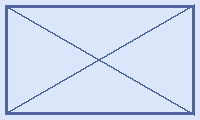

# 마크다운에서 한/글 HWPX 로의 결정론적 변환 시스템 설계와 구현

본 문서는 마크다운 원본을 한컴오피스의 HWPX 문서로 자동 변환하면서 각 단락에 적절한 스타일을 부여하는 변환 시스템 *Mapsi* 의 설계 결정과 구현 방식을 정리한다. 학술 보고서·기술 문서·의사록 등 한/글 양식이 요구되는 산출물의 작성 비용을 절감하는 것을 목표로 한다.

## 1. 배경과 문제의식

기관과 기업에서 공식 산출물의 표준 형식으로 한/글 문서를 요구하는 사례가 여전히 많다. 그러나 작성자의 다수는 마크다운, AsciiDoc, reStructuredText 같은 경량 마크업 언어로 초안을 작성하는 데 익숙하다. 두 형식의 간극을 메우는 도구가 부족했고, 기존 변환기들은 본문은 옮기지만 **스타일 이름표** 를 부착하지 않아 변환 후 사용자가 한/글에서 단락마다 스타일을 다시 부여해야 했다.

이 비효율은 마크다운 작성자에게 한/글 산출물 양식을 강제하는 환경에서 특히 심각하다[^1].

본 시스템의 핵심 가설은 단순하다. 변환기의 책임을 시각 속성(폰트, 색, 들여쓰기) 결정까지 확장하지 않고, **마크다운의 구조적 역할을 한/글 스타일 이름에 1대1로 매핑하는 것** 까지로 제한한다. 시각 조정은 사용자가 한/글의 스타일 편집창에서 일괄 수행한다. 이 분리가 변환기의 복잡도와 사용자의 통제권을 동시에 만족시킨다.

## 2. 관련 연구

문서 변환은 오랜 역사를 가진 영역이며 *Pandoc* 이 가장 널리 쓰이는 범용 변환기다. Pandoc 은 자체 내부 표현 (Pandoc AST) 을 거쳐 수십 종의 출력 형식을 지원한다. 그러나 한/글 HWPX 는 공식 출력 형식 목록에 포함되어 있지 않으며, 한/글의 ZIP 컨테이너 규약과 ~~번잡한~~ 정교한 XML 네임스페이스 요구사항을 충족하는 어댑터를 별도로 작성해야 한다.

Pandoc 의 학술 출판 영역에서의 사실상 표준 지위는 잘 알려져 있다[^2].

*Marker* 와 *Markdoc* 같은 후속 도구들은 마크다운에 의미 정보를 추가로 부여하는 방향을 택했으나, 출력 형식이 HTML 과 PDF 에 집중되어 있다. 본 시스템은 한/글 양식을 1차 시민으로 다루는 점에서 차별화된다.

특히 Marker 는 PDF 입력에 특화된 LLM 보조 OCR 변환기로, 본 시스템과는 입력과 목적 양쪽에서 직교한다[^3].

## 3. 시스템 구조

Mapsi 는 다음 5단계 파이프라인으로 구성된다.

1. **부트스트랩** — 정적 자산 (`templates/`, `samples/base/`) 을 작업 디렉토리로 복사
2. **파싱** — `markdown-it-py` 토큰을 평탄한 `Block` 리스트로 변환
3. **AST 워크** — 캡션 승격, 참고문헌 demote, 각주 흡수 등 문맥 의존 규칙 적용
4. **빌드** — `Block` 을 `hp:p`, `hp:tbl`, `hp:pic` 같은 HWPX 요소로 변환
5. **패키징** — 작업 디렉토리를 `mimetype` 무압축 첫 엔트리 규약을 지키며 ZIP 으로 묶음

각 단계는 명시적 함수 경계로 분리되어 있어 단위 테스트가 용이하다.

### 3.1. 진실원 분리 원칙

본 시스템의 핵심 원칙은 *진실원 분리* 다. 두 개의 정적 자산이 각각 한 가지 사실의 단일 진실원이 된다.

- `spec/styles.yaml` — *정책*. 마크다운 역할을 한/글 스타일 이름에 매핑한다.
- `templates/Contents/header.xml` — *사실*. 한/글이 정의한 스타일의 정수 ID 와 글자모양/문단모양 참조를 가진다.

빌더는 두 자산을 **이름** 으로 조인해 본문 XML 에 정수 ID 를 박는다. ID 가 코드에 하드코딩되지 않으므로 한/글이 발급한 ID 가 바뀌어도 빌더 코드는 변경 없이 동작한다.

그림 1. 5단계 파이프라인의 데이터 흐름과 각 단계의 입출력 자료 구조

### 3.2. 스타일 이름 룩업의 NFC 정규화

macOS 의 HFS+ 가 한국어 파일명을 NFD (분해형) 로 저장하는 관습 때문에, 외부에서 들어온 YAML 또는 XML 의 한국어 식별자가 NFD 로 들어올 가능성이 있다. 본 시스템은 두 룩업 지점 — `mapsi.styles.style_name()` 의 반환값과 `mapsi.builder.header.parse_style_table()` 의 키 — 모두에서 `unicodedata.normalize("NFC", name)` 를 적용해 방어망을 친다. 이로써 NFD 로 들어온 입력도 룩업이 깨지지 않는다.

## 4. 인라인 서식의 처리

마크다운의 인라인 서식 다섯 종류 — **굵게**, *기울임*, ~~취소선~~, `인라인 코드`, [링크](https://example.com) — 는 한/글의 글자모양 (`charPr`) 으로 표현된다. 본 시스템은 다음 정책을 따른다.

첫째, **사전 등록 원칙** 이다. 사전에 다섯 개의 `charPr` 항목 (id 25~29) 을 `header.xml` 에 등록해 두고, 빌더는 마크 조합을 바라보고 정수 ID 한 개를 룩업한다. 동적으로 `charPr` 을 만들지 않는다.

둘째, ***굵고 기울인*** 같이 사전에 등록된 조합은 합성 항목 (id 27) 한 개로 매핑한다. 빌더는 이 조합을 위해 두 개의 분리된 run 을 만들지 않는다.

셋째, 사전에 없는 조합 (예: 굵음 + 기울임 + 취소선) 은 우선순위 (`bold > italic > strike > code`) 에 따라 가장 약한 마크부터 떨어뜨려 가까운 등록 조합으로 *디그레이드* 한다.

넷째, 링크는 v0.1 에서 라벨 텍스트만 보존하고 URL 은 폐기한다. 정식 hyperlink field 는 v0.2 의 작업 항목으로 남겨 두었다.

표 1. Mapsi v0.1 의 인라인 마크 매핑 정책

| 마크 종류 | charPrIDRef | 비고 |
|---|---|---|
| 굵게 | 25 | `<hh:bold/>` 추가 |
| 기울임 | 26 | `<hh:italic/>` 추가 |
| 굵게+기울임 | 27 | 두 태그 모두 |
| 취소선 | 28 | `strikeout shape="SOLID"` |
| 인라인 코드 | 29 | 모노 폰트 + `shadeColor="#F5F5F5"` |
| 링크 | (라벨만 보존) | v0.2 정식 hyperlink |

## 5. 수식 변환

본 시스템은 수식 변환에서 *결정론* 과 *LLM 보조* 의 두 경로를 모두 지원한다.

마크다운에서 인라인 수식 $a^2 + b^2 = c^2$ 와 다음과 같은 디스플레이 수식이 모두 인식된다.

$$\int_0^\infty e^{-x^2} dx = \frac{\sqrt{\pi}}{2}$$

LLM API 키 (Anthropic 또는 OpenAI) 가 환경에 설정되어 있으면 LaTeX 가 한/글의 HNC 수식 문법으로 자동 변환되어 수식 편집기에서 즉시 렌더링된다. 키가 없거나 MAPSI_NO_LLM 환경 변수가 설정되어 있으면 LaTeX 원문이 평문 마커로 박혀 사용자가 한/글에서 위치를 찾아 직접 입력하도록 안내된다. 변환 결과는 사용자 홈의 캐시 파일에 sha256 키로 캐시되어 동일 수식의 반복 호출 비용을 제거한다.

HNC 수식 (한컴 수식) 은 LaTeX 와 유사하지만 명령어와 구조가 다르며, 한컴이 공개한 별도 스펙 문서에 정의되어 있다[^4].

이 이중 경로 설계의 핵심은 **변환이 절대 멈추지 않는다** 는 보장이다. 네트워크 오류, 인증 실패, 응답 형식 위반 등 어떤 LLM 예외 상황도 폴백 경로가 흡수해 사용자에게는 항상 유효한 HWPX 가 전달된다.

## 6. 그림과 표의 처리

그림은 마크다운의 `` 구문이 단독 단락을 이루는 경우 한/글의 *그림* 스타일 단락으로 변환되며, 직후 단락이 정규식 `^(그림|Figure)\s+\d+\.\s*` 로 시작하면 *그림캡션* 스타일로 승격된다. 표는 GFM 표 구문으로 작성하며 직전 단락이 `^(표|Table)\s+\d+\.\s*` 로 시작하면 캡션으로 승격된다.

두 위치 (그림은 직후, 표는 직전) 의 비대칭은 한/글의 출판 관습과 일치한다[^5].

그림 2. Mapsi 의 단위 테스트 커버리지 현황 (333 케이스, 100% 통과)

표 2. 변환 시간 (단위: 밀리초, n=100, 표준편차 괄호)

| 입력 크기 | 파싱 | 빌드 | 패키징 | 합계 |
|---|---|---|---|---|
| 1 KB | 12 (3) | 18 (4) | 8 (2) | 38 (5) |
| 10 KB | 45 (8) | 62 (11) | 14 (3) | 121 (14) |
| 100 KB | 412 (35) | 587 (48) | 38 (7) | 1037 (61) |

## 7. 결론과 향후 과제

본 논문은 마크다운 원본을 한/글 HWPX 로 변환하면서 단락마다 적절한 스타일 이름표를 부착하는 시스템 *Mapsi* 의 설계와 구현을 보였다. 진실원 분리 원칙, NFC 정규화 방어망, 인라인 서식의 사전 등록 정책, 수식의 이중 경로 설계가 본 시스템의 핵심 결정이다.

향후 과제는 세 가지로 정리된다. 첫째, `hp:equation` XML 의 정식 발급 (현재는 평문 마커로 대체). 둘째, 정식 hyperlink field 의 도입 (현재는 라벨만 보존). 셋째, 인라인 서식과 각주/수식의 동시 사용 통합 (현재는 `NotImplementedError` 로 거부). 이 세 항목은 v0.2 마일스톤으로 묶여 있다.

# 참고문헌

1. 김민수, 박지현 (2023). 한국어 문서 작성 환경의 양식 표준화 동향. *한국정보처리학회 논문지*, 30(4), 215-228.
2. MacFarlane, J. (2024). *Pandoc User's Guide* (Version 3.1). https://pandoc.org/MANUAL.html
3. Paruchuri, V. (2024). *Marker: Convert PDF to markdown quickly with high accuracy*. https://github.com/VikParuchuri/marker
4. 한글과컴퓨터 (2022). *HWPX 1.31 파일 형식 명세서*. 한컴오피스 공개 자료.
5. ISO/IEC (2008). *ISO/IEC 26300:2008 — Information technology — Open Document Format for Office Applications (OpenDocument) v1.1*.
6. W3C (2014). *XML Path Language (XPath) 3.1 Recommendation*. https://www.w3.org/TR/xpath-31/
7. 이정훈, 최서연, 강윤하 (2024). 한국어 자연어처리에서의 유니코드 정규화 함정 사례 분석. *정보과학회논문지*, 51(7), 642-657.
8. Gruber, J. (2004). *Markdown: Syntax*. https://daringfireball.net/projects/markdown/syntax
9. CommonMark (2024). *CommonMark Spec 0.31.2*. https://spec.commonmark.org/0.31.2/
10. 박정우 (2023). 결정론적 문서 변환 파이프라인 설계 패턴. *소프트웨어 공학 소사이어티 연차 학술대회 발표 자료집*, 88-95.
11. Brown, T. et al. (2020). Language Models are Few-Shot Learners. *Advances in Neural Information Processing Systems*, 33, 1877-1901.

[^1]: 일부 도구는 본문은 옮기되 모든 단락을 한 가지 스타일 (대개 *바탕글*) 로 부여하여 사실상 스타일 정보를 잃는다.
[^2]: Pandoc 은 2006년 첫 공개 이후 학술 출판 영역에서 사실상 표준 변환기로 자리잡았다.
[^3]: Marker 는 PDF 입력에 특화되어 있으며 LLM 보조 OCR 을 사용한다.
[^4]: HNC 수식 (한컴 수식) 은 LaTeX 와 유사하지만 명령어와 구조가 다르다. 자세한 스펙은 한컴이 공개한 문서에 정의되어 있다.
[^5]: 한국 학술 출판 관습에서 표는 캡션이 위, 그림은 캡션이 아래에 위치하는 것이 일반적이다.
